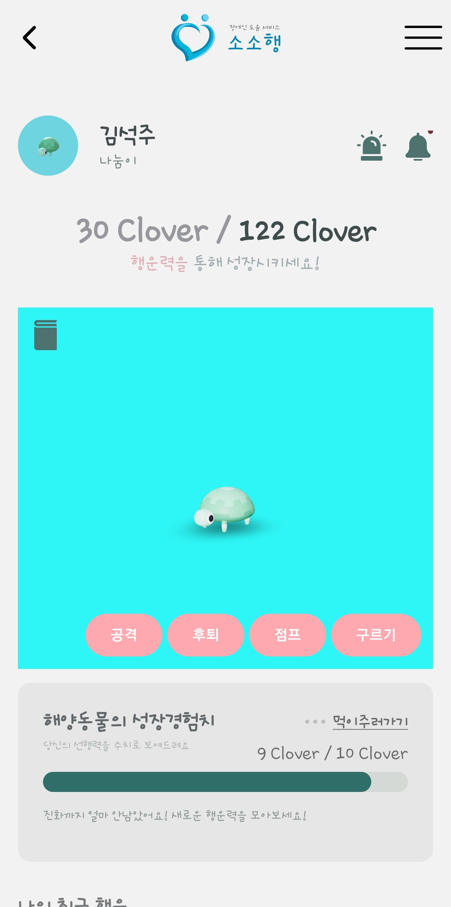

## 목차
1. 프로젝트 소개
2. 설계
3. 주요 기능
4. 시연
5. 개발환경
6. 팀원소개 및 개발기간

## 프로젝트 소개

### 서비스 소개
장애인 사용자가 도움을 요청하면, 주변 사용자들에게 알림을 통해 도움이 필요한 상황을 알려주고, 도와줄 의사가 있는 사용자를 매칭해주는 실시간 도움 매칭 서비스입니다.

### 기획 배경
오타니 쇼헤이의 "행운을 주워 담는 행위"에서 착안하여 선행을 베풀면 그 행위가 다시 사회에 남아 나에게 돌아 온다는 것을 컨셉으로 사용자들이 부담없이 도움을 주고 받을 수 있는 매개체를 만드는 것을 목표하였습니다.

### RESEARCH
2022년 장애인이 겪는 고용차별, 직장생활 내 차별을 스스로 헤쳐가는 드라마 '이상한 변호사 우영우'의 등장으로 많은 사람들에게 장애에 대한 인식을 다시 생각해볼 수 있는 한 해가 되었습니다. 하지만 해당 우영우는 판타지라는 의견도 분분합니다. 이유인 즉슨, 대형 로펌의 동료 직원들에게 도움을 받지만, 현실은 우영우처럼 장애인 스스로 현실을 극복하기 어려운 상황들이 여러 직면하기 때문입니다. 특히나 거리에는 장애인이 쉽게 보이지 않는데 이유는 장애인에게 선의를 베푸는 것을 봉사활동이라고 생각하는 사회적 풍토가 만연하기 때문입니다. 저희 A509팀은 일상생활에서의 선의가 봉사라는 의미가 아닌 '공존'이라는 의미를 상기시켜 특별함이 아닌 일상생활에서의 관계맺기 및 도움요청 어플리케이션을 개발하였습니다.

### 페르소나 분석

1. 

### 서비스 특징
- 부담없는 도움 요청
    장애인에 대한 인식이 두려워 간단한 도움도 쉽게 요청하지 못하는 장애인이 부담없이 도움을 요청할 수 있도록 하였습니다.

- 쉬운 도움 상황 인식
    주변에 관심을 두지 않거나 어떤 어려움이 있는지 모르는 비장애인들이 도움이 필요한 상황을 쉽게 인식할 수 있도록 하였습니다.

- 행운 컨텐츠 제공으로 사용자 선행 유도
    포춘 쿠키 및 클로버 지급, 캐릭터 성장 컨텐츠로 도움을 주는 사용자가 선행을 수치화 할 수 있고, 선행을 쌓아가는 데 즐거움을 느낄 수 있도록 하였습니다.

## 설계
### 시스템 아키텍처

### ERD

### 요구사항 명세서

### API 명세서

## 주요 기능
- 장애인 인증
  - 가입 시 장애인 증명서를 통한 장애인 인증
  - 최초 인증 1회로 간편하게 서비스 이용 가능
      
- 거리기반 매칭
  - 거리 기반 도움 매칭으로 가까운 위치부터 신속한 사용자 매칭 가능
  - 상황을 명시, 도움을 줄 의사가 있는 사용자가 매칭되므로 부담없는 도움 요청 가능
      
- 지도 (실시간 거리 안내)
  - 사용자의 위치 파악 가능
  - 상황을 명시, 도움을 줄 의사가 있는 사용자가 매칭되므로 부담없는 도움 요청 가능
      
- 도움 카테고리화
  - 도움 내용을 카테고리화하여 보다 간편한 요청이 가능
  - 사용자 기반 카테고리 추천으로 다양한 도움 요청 가능
      
- 채팅 기능
  - 사용자 매칭 후 채팅으로 보다 상세한 요청 및 상황 공유 가능
      
- 행운 캐릭터 제공
  - 도움 요청 후 지급되는 클로버로 캐릭터를 성장시키며 행운을 모아가는 것에 재미를 느끼도록 함
      
- 포춘 쿠키 제공
  - 도움 요청 후 행운메시지가 담긴 쿠키를 제공, 도움 후 행운 메시지를 통한 사용자 격려

## 시연

### 홈

### 지도
- 도움 요청 현황이 핀으로 표시되며 각 핀을 누르면 도움 내용을 상세히 볼 수 있습니다. 
- 매칭 시에는 상대방의 위치까지 길안내를 제공합니다. 

### 사이드바
- 사이드바를 통해 메뉴를 한눈에 모아볼 수 있습니다.

### 카테고리 선택
- 도움을 카테고리화 하여 제공합니다.
- 최근 사용 카테고리를 조회할 수 있습니다. 
- 비슷한 유저들이 사용한 카테고리를 추천받을 수 있습니다.

### 마이페이지
- 보유한 클로버 확인이 가능합니다. 
- 알림을 모아볼 수 있으며, 프로필 설정이 가능합니다.
- 최근 완료된 도움 이력을 확인할 수 있습니다.

### 몬스터
- 도움을 통해 지급받은 클로버로 동물을 성장 시킬 수 있습니다.
- 육지동물, 해양동물, 조류 3가지 유형의 동물을 성장시킬 수 있습니다. 

### 도감
- 각 유형마다 레벨업을 통해 새로운 동물을 지급받을 수 있고, 도감기능으로 동물을 모아볼 수 있습니다.
- 도감이 활성화 된 경우 대표 캐릭터로 등록도 가능합니다.

### 도움 요청
- 카테고리, 요청내용, 위치를 입력하여 도움 요청을 합니다.

### 매칭 대기
- 요청 완료 시 주변 사용자들을 탐색하고 사용자들에게 요청 내용을 전송합니다. 
- 탐색 시 주변에 사용자가 없는 경우 50m 단위로 범위를 넓혀가며 탐색을 진행합니다.
- 사용자는 탐색 중 요청을 취소할 수 있으며 1분 이내에 요청에 응한 사용자가 없을 경우 매칭에 실패합니다.

### 도움 내용
- 사용자는 핀 위치를 클릭하여 상세한 도움 요청 내용을 확인할 수 있습니다.
- 연결하기 버튼을 통해 도움 요청에 응할 수 있습니다.
- 다시 지도부분을 눌러 요청에 응하지 않거나 다른 요청을 확인할 수 있습니다.

### 채팅
- 매칭이 완료된 경우 사용자간 채팅 방이 생성됩니다.
- 채팅을 통해 도움에 대한 상세한 정보를 확인할 수 있습니다.

### 도움중
- 도움이 진행 중인 경우 취소를 누를 수 있습니다. 
- 완료 시에는 완료 버튼을 눌러 도움을 완료할 수 있습니다.

### 포춘쿠키
- 도움이 완료된 경우 포춘쿠키를 지급받을 수 있습니다. 
- 포춘쿠키는 오픈 시 랜덤 행운 메시지를 확인할 수 있으며 확인시 포춘쿠키는 소멸됩니다.

### 소소몬 키우기
- 마이페이지에서 귀여운 소소몬의 애니메이션을 통해 소소몬을 키워나갈 수 있습니다.

### 관리자 페이지
- 어플리케이션에서 신고한 사용자들의 신고내용 및 신고 누적을 볼 수 있습니다.

## 개발환경
### FrontEnd

### BackEnd

### Infra

### Development Tool

### Communication Tool

## 팀원소개 및 개발기간
|김석주|김성재|왕준영|윤태영|정민희|최찬영|
|:-----:|:-----:|:-----:|:-----:|:-----:|:-----:|
|Leader Back-end|Back-end|Back-end Infra|Front-end|Back-end|Front-end|

